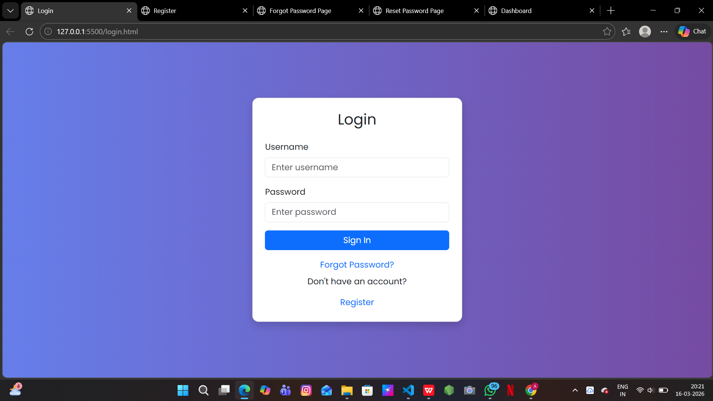
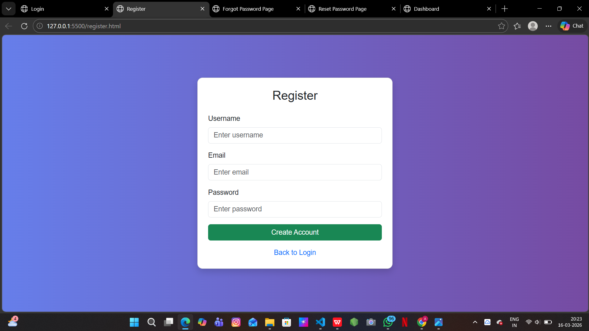
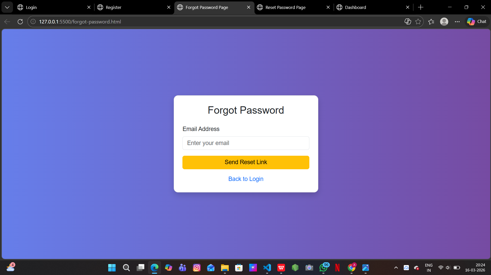
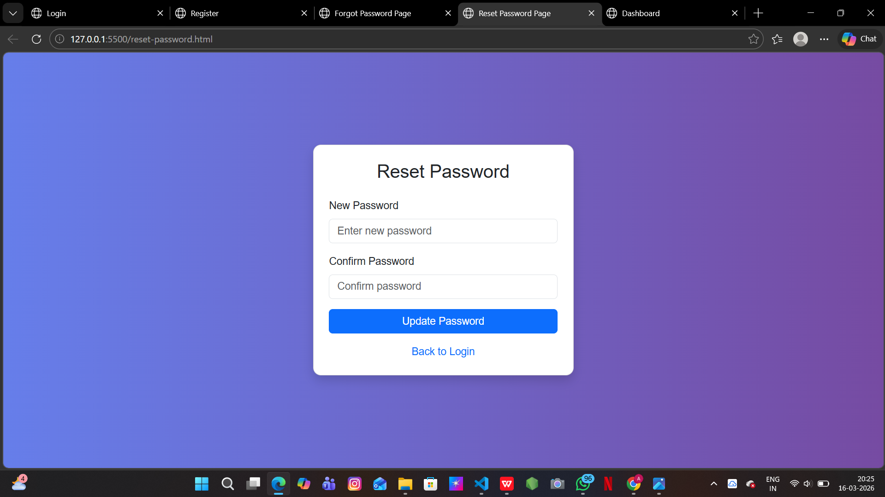

# CampusPe Authentication System

This project is a simple **Authentication System UI** developed using **HTML, CSS, and Bootstrap 5**.  
It demonstrates the basic structure of a login-based web application with multiple authentication pages.

The project includes responsive pages for login, registration, password recovery, and a dashboard interface.

---

## 🚀 Features

- User Login Page
- User Registration Page
- Forgot Password Page
- Reset Password Page
- Dashboard Page after login
- Responsive UI using Bootstrap 5
- Clean and simple authentication workflow
- Modern UI styling

---

## 🛠 Technologies Used

- HTML5
- CSS3
- Bootstrap 5
- Bootstrap Icons

---

## 📂 Project Structure

---

## 📸 Screenshots

### 🔐 Login Page

---

### 📝 Register Page

---

### ❓ Forgot Password Page

---

### 🔄 Reset Password Page

---

### 📊 Dashboard

---

## 📖 How It Works

1. User enters credentials on the **Login Page**
2. If the user does not have an account, they can go to **Register Page**
3. If the user forgets their password, they can use **Forgot Password**
4. Password can be updated using **Reset Password Page**
5. After login, the user is redirected to the **Dashboard Page**

---

## 📌 Purpose of This Project

This project was developed as part of a **Frontend Assignment** to demonstrate:

- Multi-page authentication UI
- Bootstrap integration
- Basic navigation flow between pages
- Responsive UI design

---

## 👩‍💻 Author

**Anushree.D**

GitHub Repository:  
https://github.com/anushree415/Campuspe-Assignment-2

---
