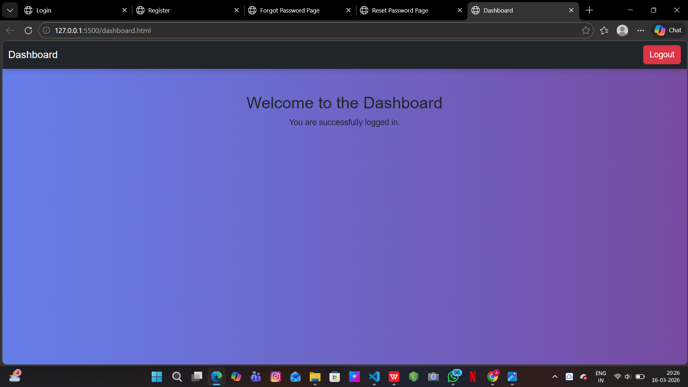

# 🚀 CampusPe Authentication System

This project is a **Frontend Authentication System UI** developed using **HTML, CSS, and Bootstrap 5**.
It demonstrates the structure of a basic login-based web application with multiple authentication pages and a dashboard interface.

The project focuses on **responsive design, clean UI, and simple navigation flow** between authentication pages.

---

# ✨ Features

✔ User Login Page
✔ User Registration Page
✔ Forgot Password Page
✔ Reset Password Page
✔ Dashboard Page after login
✔ Responsive design using Bootstrap
✔ Simple authentication flow UI
✔ Clean and modern layout

---

# 🛠 Technologies Used

* **HTML5**
* **CSS3**
* **Bootstrap 5**
* **Bootstrap Icons**

---

# 📂 Project Structure

```
Campuspe-Assignment-2
│
├── login.html
├── register.html
├── forgot-password.html
├── reset-password.html
├── dashboard.html
├── style.css
├── README.md
│
└── screenshots
    ├── login.png
    ├── register.png
    ├── forgot-password.png
    ├── reset-password.png
    └── dashboard.png
```

---

# 📸 Project Screenshots

## 🔐 Login Page


---

## 📝 Register Page


---

## ❓ Forgot Password Page


---

## 🔄 Reset Password Page


---

## 📊 Dashboard Page



---

# 📖 Application Flow

1️⃣ User opens the **Login Page**
2️⃣ If the user does not have an account, they can navigate to the **Register Page**
3️⃣ If the user forgets the password, they can access the **Forgot Password Page**
4️⃣ Password can be updated using the **Reset Password Page**
5️⃣ After successful login, the user is redirected to the **Dashboard Page**

---

# 🎯 Purpose of This Project

This project was created as part of a **Frontend Development Assignment** to demonstrate:

* Multi-page authentication UI
* Bootstrap integration
* Page navigation between authentication screens
* Responsive UI design

---

# 👩‍💻 Author

**Anushree.D
USN:1RF22IS010**

GitHub Repository:
https://github.com/anushree415/Campuspe-Assignment-2

---


